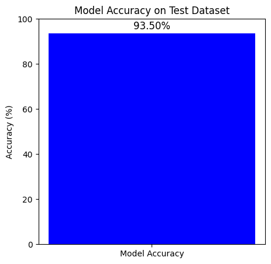
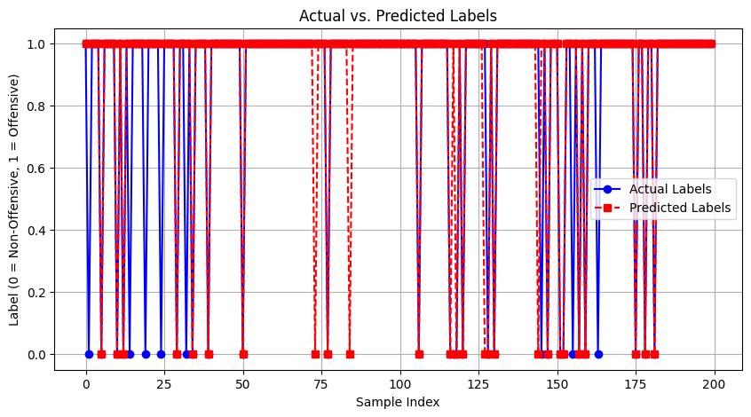

# 🧠 Offensive Language Detection using NLP and Machine Learning

This project focuses on **detecting offensive language** in text data using **Natural Language Processing (NLP)** and **Machine Learning** techniques.  
It classifies input text as **offensive** or **non-offensive**, helping moderate online platforms and create a safer communication environment.

---

## 🚀 Features

- 🧩 Detects if a given text is **offensive** or **non-offensive**
- 🧠 Uses **NLP preprocessing** and **ML classification models**
- 📊 Provides **accuracy, precision, recall, F1-score, confusion matrix**
- 📈 Includes **visualizations** for model performance and predictions
- 💻 Fully implemented in a **Jupyter / Google Colab notebook**

---

## 🧰 Tech Stack

| Category | Tools / Libraries |
|-----------|-------------------|
| Language | Python |
| Environment | Google Colab / Jupyter Notebook |
| NLP | NLTK, spaCy, TfidfVectorizer |
| ML Models | Logistic Regression, Random Forest, SVM |
| Data Handling | pandas, numpy |
| Visualization | matplotlib, seaborn, wordcloud |

---

## 📊 Model Performance

**Model Accuracy on Test Dataset:**  
`Accuracy: 93.50%`

You can visualize the model's performance using the plot below.

### 🔹 Model Accuracy Plot

## 📈 Actual vs Predicted Values

The plot below shows how close the model’s predictions are to the actual values.

---

## 💬 Model Output 

This section demonstrates how the trained model classifies text inputs as **Offensive** or **Non-Offensive**.

